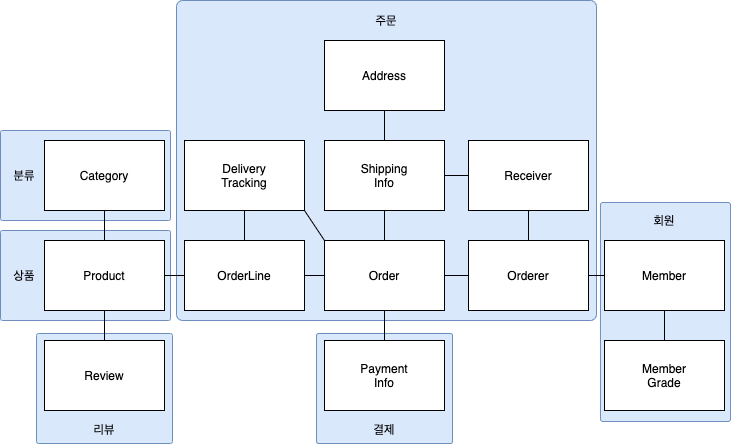

# 애그리거트

### 애그리거트

- 복잡한 도메인을 이해하고 관리하기 쉬운 단위로 만들려면 상위 수준에서 모델을 조망할 수 있는 방법이 필요. 이를 위한 개념이 애그리거트
- 애그리거트를 사용해서 모델 간의 관계를 개별 모델 수준과 상위 수준에서 모두 이해 가능
- 일관성을 관리하는 기준이 될 수 있음
- 애그리거트는 관련된 모델을 하나로 모았기 때문에 한 애그리거트에 속한 객체는 유사하거나 동일한 라이프 사이클을 갖음
	- 도메인 규칙에 따라 함께 생성, 수정되는 구성요소는 한 애그리거트에 속한 가능성이 높음
	- `주의` 'A가 B를 갖는다'는 규칙은 반드시 통용되는 조건은 아님
		- 예) 상품과 리뷰
      		- 상품은 리뷰를 갖지만 상품과 리뷰 라이프 사이클은 다름
      		- 리뷰의 변경이 상품의 변경을 가져오지 않음

### 애그리거트 루트

- 애그리거트의 일관된 상태를 유지하려면 애그리거트 전체를 관리할 주체가 필요 -> 이 책임을 지는 것이 애그리거트의 루트 엔티티
- 애그리거트 내의 일관성이 깨지지 않도록 관리하는 역할을 가짐
- 애그리거트 루트는 내부의 다른 객체를 참조나 조합을 하여 기능을 제공함
- 하나의 트랜잭션에서는 한 개의 애그리거트만 수정해야 함
	- Why? 범위가 커지면 DB 테이블 잠금 대상이 많아지고 이는 동시성 처리 성능을 떨어트림
	- 이는 하나의 애그리거트가 다른 애그리거트를 변경하지 않는 것을 의미함
	- 부득이하게 하나의 트랜잭션으로 2개 이상의 애그리거트를 수정해야 한다면 응용 영역에서 처리하도록 함
- 하나의 애그리거트가 다른 애그리거트를 참조하게 되면 다음과 같은 문제가 생길 수 있음
	1. 편한 탐색으로 인한 오용
		- 한 애그리거트 내부에서 다른 애그리거트 객체에 접근할 수 있으면 다른 애그리거트 상태를 쉽게 변경 할 수 있음
	2. 성능에 대한 고민
		- 성능과 관련된 여러 가지 고민이 필요함
		- Lazy 로딩과 Eager 로딩의 두 가지 방식 중에 무엇을 사용할지는 애그리거트의 어떤 기능을 사용하느냐에 따라 달라짐
	3. 확장의 어려움
		- 사용자가 많고 트래픽이 증가하게 되면 부하를 분산하기 위해 도메인 별로 시스템을 분리하기 시작함
		- 이 과정에서 서로 다른 도메인이 다른 DBMS를 사용할 수 있음
- 이를 해결하기 위해선 객체가 아닌 ID를 이용해서 다른 애그리거트를 참조하는 것이 좋음
	- 복잡도를 낮추는 것과 함께 한 애그리거트에서 다른 애그리거트를 수정하는 문제를 근본적으로 방지함
	- 애그리거트 별로 다른 RDMS 구현기술을 사용하는 것도 가능함 