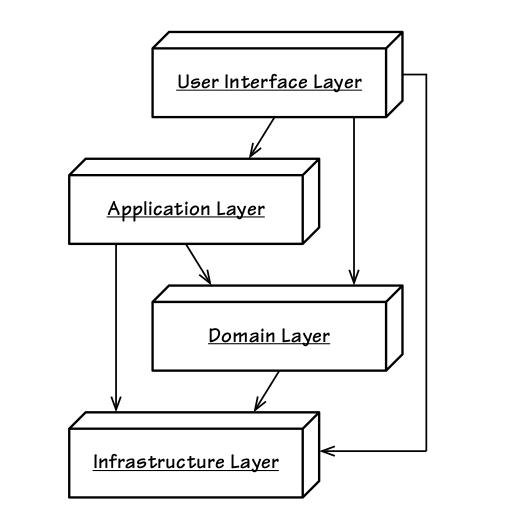

# 아키텍처 개요

### 표현 영역(또는 UI 영역)

- 사용자 요청을 받아 응용영역에 전달 & 응용영역의 처리 결과를 다시 사용자에게 보여주는 역할
- 사용자 = 웹 브라우저 사용하는 사람 or REST API를 호출하는 외부 시스템


### 응용 영역

- 시스템이 사용자에게 제공해야 할 기능을 구현

  - 주문 등록, 주문 취소, 상품 상세 조회 등

- 기능 구현을 구현하기 위해 도메인 영역의 도메인 모델을 사용

- 로직을 직접 수행하기 보다는 도메인 모델에 로직 수행을 위임

  ```
  # 예시
  public class CancelOrderService {
  	@Transactional
  	public void cancelOrder(String orderId) {
  		Order order = findOrderById(orderId)
  		if (order == null) throw new OrderNotFoundException(orderId);
  		**order.cancel()
  	}**
  }
  ```


### 도메인 영역

- 도메인의 핵심 로직을 구현함


### 인프라스트럭처 영역

- 구현 기술에 대한 것을 다룸
- RDBMS 연동, 메시징 큐에 메시지를 전송하거나 수신하는 기능 구현 등
- 다른 영역에서는 구현 기술을 사용한 코드를 직접 만들지 않음
  - 인프라스트럭처 영역에서 구현된 모듈을 사용


# 계층구조



- 상위 계층에서 하위 계층으로의 의존만 존재하고 하위 계층에서 상위 계층에 의존하지 않음
- 계층 구조를 엄격하게 적용하면 바로 아래의 계층에만 의존을 가져야 하지만 구현의 편리함을 위해 계층 구조를 유연하게 적용하기도 함
- 인프라스트럭처에 의존하면 ‘테스트 어려움'과 ‘기능확장의 어려움' 2가지 문제 발생